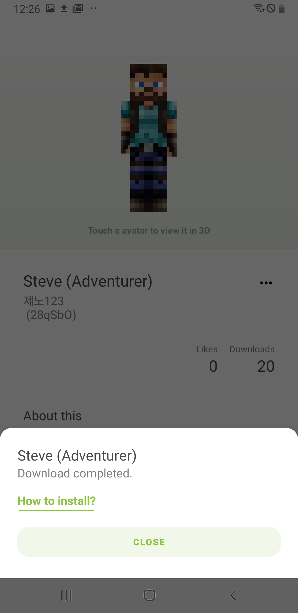
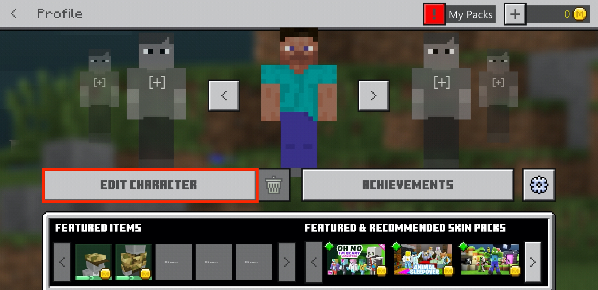
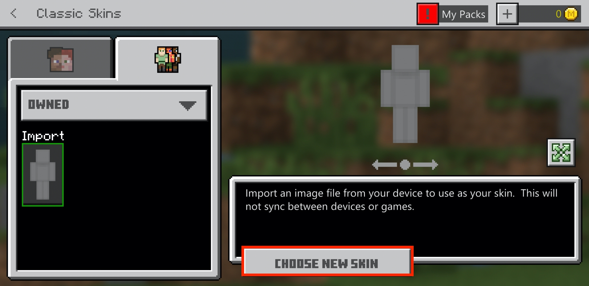

# Store for Minecraft : Skins Installation Guide

Most of the skins that are downloaded form Store for Minecraft needs to be applied by user in Minecraft application.

## 1. Downloading Files

Find a skin you want to apply in Store for Minecraft.

Press **"Download"** button to install the skin file.

If it's downloaded, user can find the skin file in gallery app from user's device.

Downloaded skin files are saved in **LocalStorage/StoreForMinecraft/files/skin**

## 2. Applying Skin File

Start Minecraft application.

Choose **"Profile"**

Select **"Edit character"**

Select **second tab**

Select **"Owned"**

Select **first avatar**

Select **Choose new skin**

When gallery app is launched, locate the skin file.

Choose a model type you want to apply

Ta-da! Skin is applied!