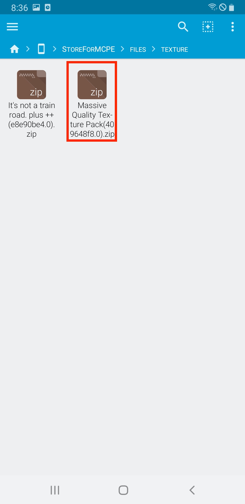
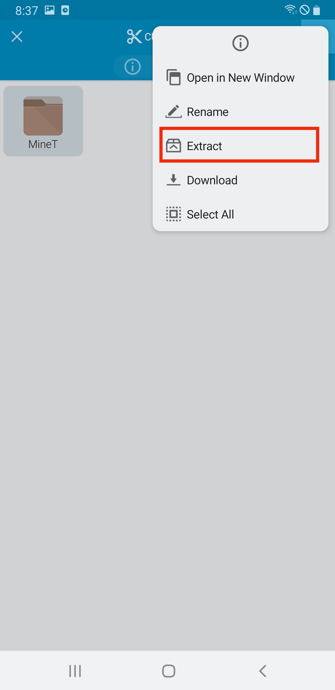
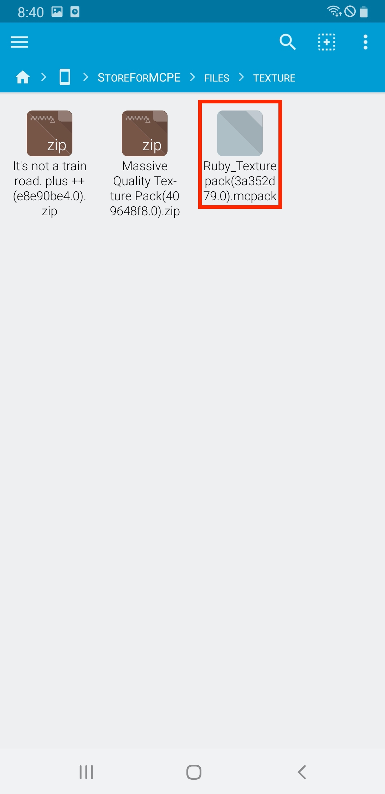
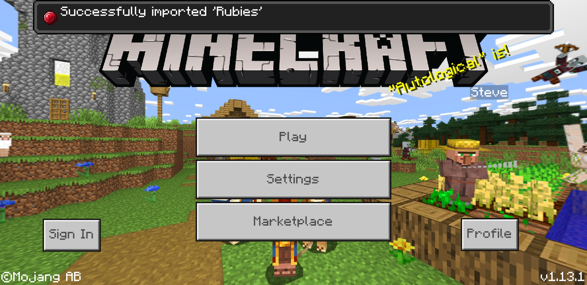
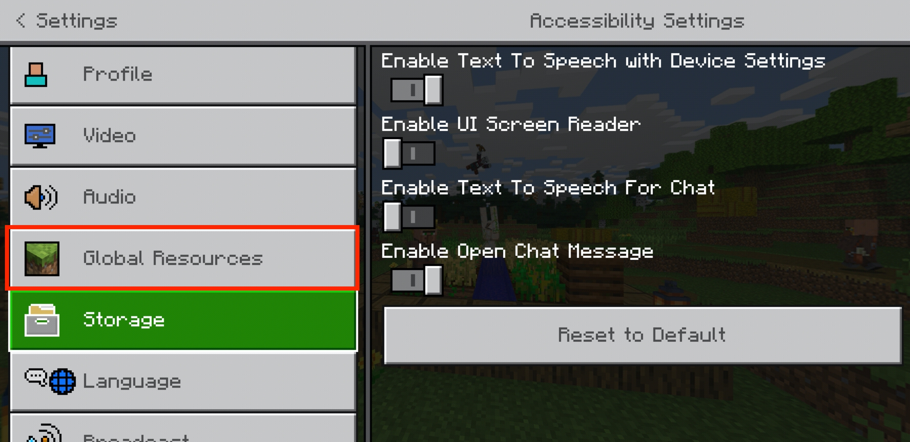
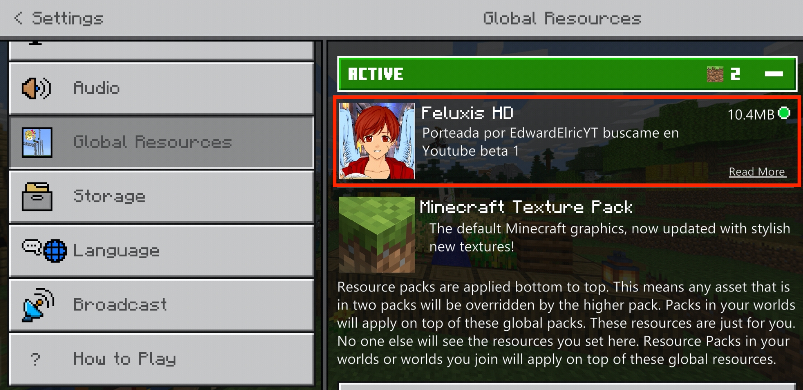

# Store for Minecraft : Texturepack installation guide

Most of the texturepack files that are uploaded, **are installed automatically, and can be found when launching the application.**

However, there are some devices that automatic installation may not work, so please follow the directions bellow for manual install.

## 1. Downloading Files

You can check the message "Download completed." when files are downloaded with no problem.

**Textures will be installed as soon as you download the file,** which can be found in minecraft application.

After downloading the file, please follow **"5. Applying installed texturepack in minecraft"**

if you cannot find downloaded texture, please follow the manual instruction from **"2. Installing file explorer"**

## 2. Installing file explorer 

To begin maunal installation, you should **install application that supports unzipping files.**

You may skip this process if you already have file explore application that supports unzipping files. 

If not, we recommend you to install **FX File Explorer.**

[Get it from Google Play](https://play.google.com/store/apps/details?id=nextapp.fx)

When file explorer is downloaded, please run the app.

## 3. Locating downloaded file

Choose **"Main Storge"**

Select **"StoreForMCPE"**

Select **"files"** 

Select **"texture"**

You can find downloaded texture files here.

If the file format is **.zip, please go to section 4 - A.** If file format is **.mcpack, .mcworld, or .mcaddon, please go to section 4 - B.**

## 4 - A. Installing downloaded files (.zip)

Choose a **texture file that you want to install.** 

**Long press the folder inside the zip file.**

Choose **three dot menu** at the right top.

Choose **"Extract"** button.

Select **"Main Stroage."**

Select **"games."**

Select **"com.mojang."**

Select **"resource_packs"**

Select **"Extract Here."**

After all steps are done, texture files are completely installed. Go to section 5 to apply texture.

##4 - B. Installing downloaded files (.mcworld, .mcpack, .mcaddon)

Choose a **texture file** you want to install.

Select **"Minecraft"**

Minecraft will be **launched automatically**

If you see a message **Successfully imported,** now it's time to enjoy playing minecraft!

##5. Applying installed texturepack in minecraft

Go to **Settings** in the main menu.

Choose **Global Resources** menu.

Select a texture pack you want to apply, and press **Activate**

Everything is good to go if **texturepack you have chosen is placed at the top.**