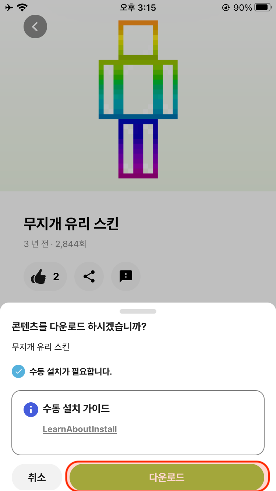

# iOS 자료 수동 설치 방법 - 스킨

**iOS의 경우** 다른 애플리케이션의 직접적인 접근이 불가능하여 수동으로 설치하는 방식만 제공해드리는 점 양해부탁드립니다.

이 글에서는 SFOM에서 "스킨" 자료를 다운로드 하여 사용자의 마인크래프트에 적용하는 방법을 설명합니다.

## 자료 다운로드 하기

1. 스폼 애플리케이션에서 "스킨" 자료를 다운로드 합니다.
2. 다운로드가 완료 된 파일은 "나의 iPhone" > "스폼" > "downloads" > "Skin" > "자료 게시글 이름" 저장 됩니다.
    1. 예시를 들어 "무지개 유리 스킨" 이라는 게시 자료를 다운로드 받았다면 설치 경로는 "나의 iPhone" > "스폼" > "downloads" > "Skin" > "무지개 유리 스킨" 입니다.

## 자료 이미지 저장하기
1. "파일" 앱에서 "나의 iPhone" > "스폼" > "downloads" > "Skin" > "자료 게시글 이름"으로 이동합니다.
2. 해당 파일을 선택한 뒤, 공유 버튼을 클릭하여 이미지 저장을 클릭합니다.

## 자료 적용하기
1. 마인크래프트를 실행한 뒤, 탈의실로 이동합니다.
2. 왼쪽의 세 번째 메뉴인 클래식 스킨을 선택합니다. 
3. 소유 스킨을 클릭한 뒤 새 스킨 선택을 선택합니다.
4. 다운로드 받은 스킨 이미지를 선택하여 마인크래프트에 스킨을 적용합니다.

## 이미지 가이드

| 원하는                                                 | 스킨을                                                  | 다운로드!                                             |
|-----------------------------------------------------|-----------------------------------------------------|---------------------------------------------------|
|  |  |  |

| 파일 앱 ->                                           | 나의 아이폰 ->                                         | 스폼 ->                                             | 
|---------------------------------------------------|---------------------------------------------------|---------------------------------------------------|
|  |  |  | 

| downloads ->                                      | Skin ->                                            | 컨텐츠 선택                                            |
|---------------------------------------------------|---------------------------------------------------|---------------------------------------------------|
|  |  |  |

| 공유                                                  | 이미지 저장                                              |
|-----------------------------------------------------|-----------------------------------------------------|
|  |  | 

| 마인크래프트 실행 및 탈의실 이동                                  | 클래식 스킨                                              | 소유 스킨                                               |
|-----------------------------------------------------|-----------------------------------------------------|-----------------------------------------------------|
|  |  |  |

| 새 스킨 선택                                             | 컨텐츠 선택                                             | 적용                                                  |
|-----------------------------------------------------|----------------------------------------------------|-----------------------------------------------------|
|  |  |  |

---

Jeonhui Lee, 작성 : 2023년 7월 17일 