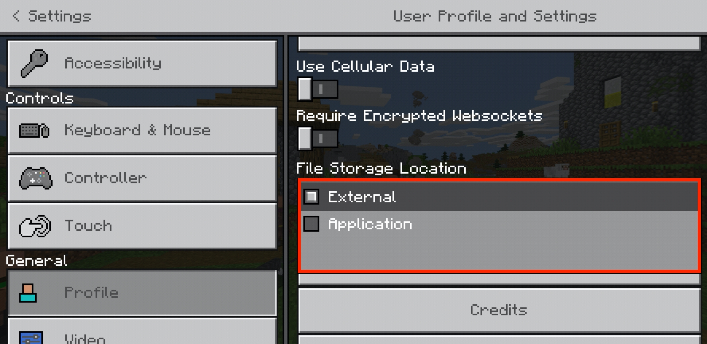
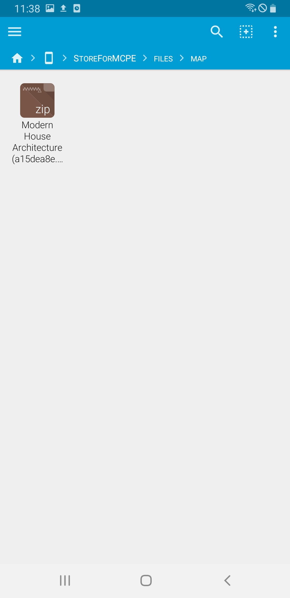
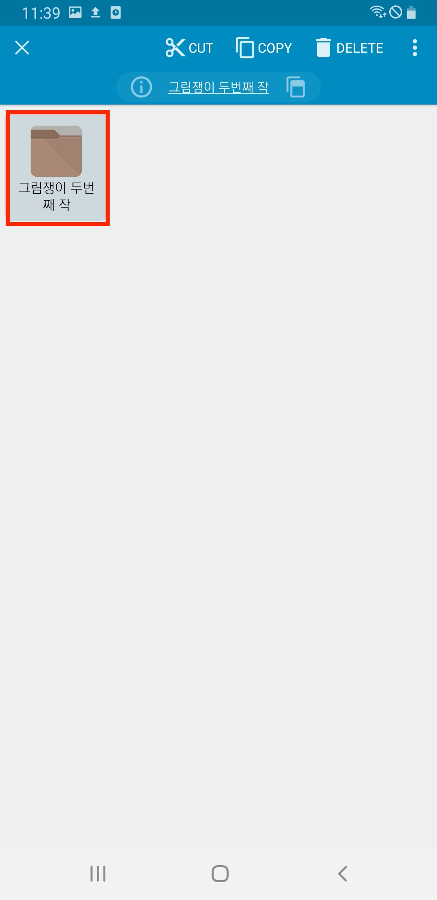
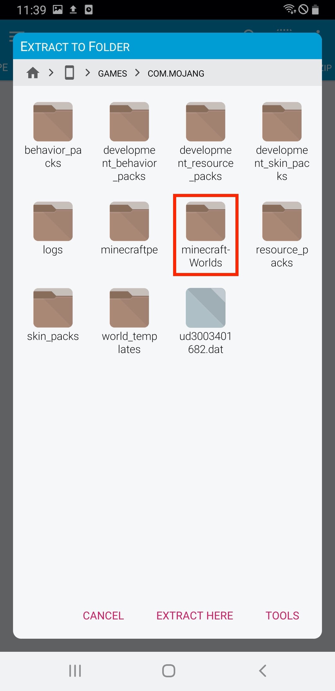

# Store for Minecraft : Map Installation Guide

Most of the map files that are uploaded, **are installed automatically, and can be found when launching the application.**

However, there are some devices that automatic installation may not work, so please follow the directions bellow for manual install.

## 1. Downloading Files

You can check the message "Download completed." when files are downloaded with no problem.

**Maps will be installed as soon as you download the file,** which can be found in minecraft application.

However, there are some internal problems occuring that automatic installation may not work, so please follow the directions bellow for manual install.

### 1 - A. Map is installed, but unable to find 

Sometimes, maps are not displayed properly even if it was installed. This happens when the map file has problem itself, or when map's storage was set to "application". 

In this case, you need to set the storage to "external", from "application".

Go to **"Settings"** 

Choose **"Profile"**

If file storage location is set to "Application", switch it to **"External"**

**If map installation fails continuously, follow bellow for manual install**

## 2. Installing file explorer 

To begin maunal installation, you should **install application that supports unzipping files.**

You may skip this process if you already have file explore application that supports unzipping files. 

If not, we recommend you to install **FX File Explorer.**

[Get it from Google Play](https://play.google.com/store/apps/details?id=nextapp.fx)

When file explorer is downloaded, please run the app.

## 3. Locating downloaded file

Choose **"Main Storage"**

Select **"StoreForMCPE"**

Select **"files"**

Select **"map"**

You can find downloaded map files here.

If the file format is **.zip, please go to section 4 - A.** If file format is **.mcworld, please go to section 4 - B.**

## 4 - A. Installing downloaded files (.zip)

**Long press the folder inside the zip file.**

Choose **three dot menu** at the right top.

Select **"Extract"**

Select **"Main Storage"**

Select **"games"**

Select **"com.mojang"**

Select **"minecraftWorlds"**

Select **"EXTRACT HERE"**

Congratulations! Now you can enjoy map in minecraft application.

## 4 - B. Installing downloaded files (.mcaddon)

Choose a map file you want to install.

Select **"Minecraft"**

Map will be automatically installed as Minecraft app launches.

If you see a mesage **Level import finished successfully**, you can enjoy the map now!