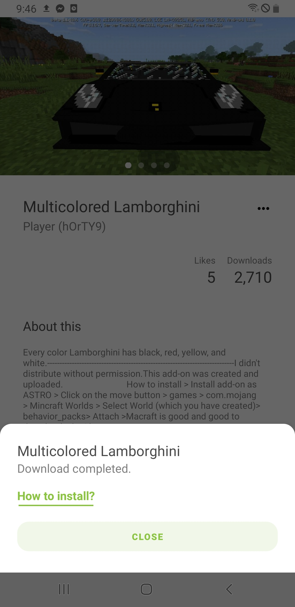
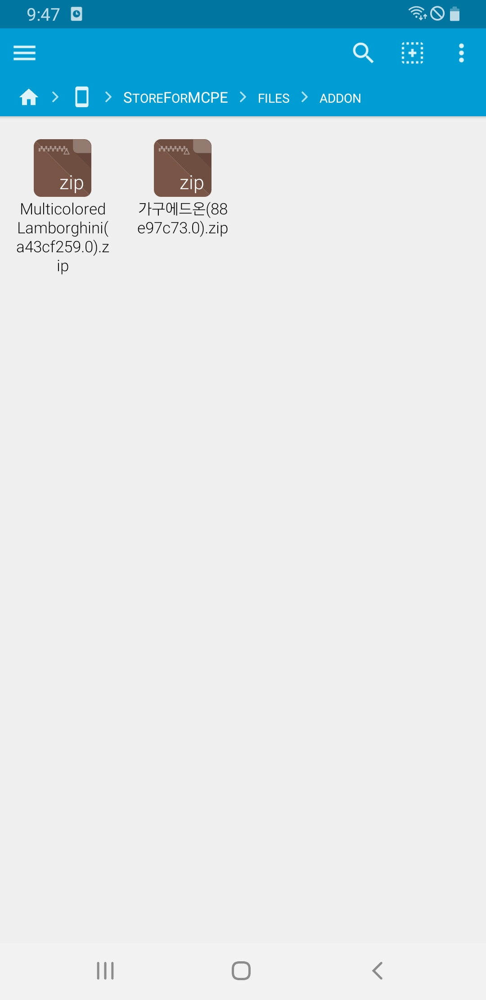
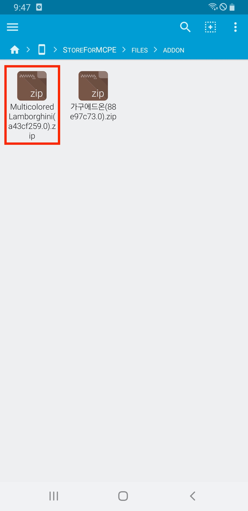
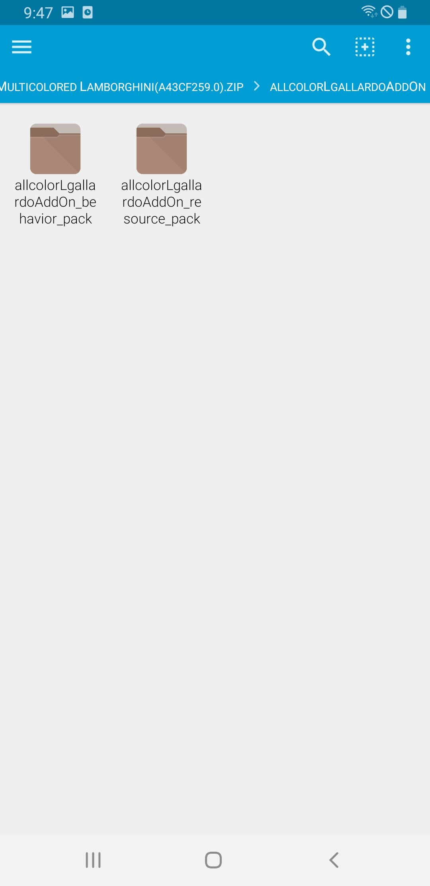
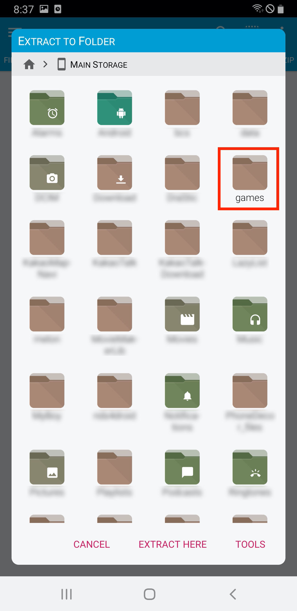

# Store for Minecraft : Add-on installation guide

Most of the add-on **requires maual installation**, since add-on doesn't support automatic installation.

## 1. Downloading Files 

You can check the message "Download completed." when files are downloaded with no problem.

**Most of the add-on requires maual installation.**

Please follow below to install add-ons.

## 2. Installing file explorer 

To begin maunal installation, you should **install application that supports unzipping files.**

You may skip this process if you already have file explore application that supports unzipping files. 

If not, we recommend you to install **FX File Explorer.**

[Get it from Google Play](https://play.google.com/store/apps/details?id=nextapp.fx)

When file explorer is downloaded, please run the app.

## 3. Locating downloaded file

Choose **"Main Storge"**

Select **"StoreForMCPE"**

Select **"files"** 

Select **"addon"**

You can find downloaded addon files here.

If the file format is **.zip, please go to section 4 - A.** If file format is **.mcpack, .mcworld, or .mcaddon, please go to section 4 - B.**

##4 - A. Installing downloaded files (.zip)

**Choose an add-on file you want to install**

Normaly, there are two types of add-on files : **Behavior Pack and Texture (Resource) Pack.**

If not, you should check descriptions of the add-on file, or contact to uploader to check installation guide.

Each Behavior Pack and Texture Pack needs to be extracted in different folders.

**Behavior Pack :** /games/com.mojang/behavior_packs/

**Texture (Resource) Pack** : /games/com.mojang/resources_packs/

Please follow bellow to learn how to extract and save the file to each directory.

Long-press and select **Behavior Pack** folder.

Choose **three dot menu** at the right top.

Choose **"Extract"**

Select **"Main Stroage."**

Select **"games."**

Select **"com.mojang."**

Select **"behavior_packs"**

Select **"Extract Here"**

Long-press and select **Texture (Resources) Pack** folder.

Choose **three dot menu** at the right top.

Select **"Extract"**

Select **"Main Storage"**

Select **"games"**

Select **"com.mojang"**

Select **"resource_packs"**

Select **"Extract Here"**

After all steps are done, add-on files are completely installed. Go to section 5 to apply add-ons.

## 4 - B. Installing downloaded files (.mcworld, .mcpack, .mcaddon)

Choose an **add-on file** you want to install.

Select **"Minecraft"**

Minecraft will be **launched automatically**.

If you see a message **Successfully imported,** now it's time to enjoy playing minecraft!

## 5. Applying add-on

Add-on can be applied when generating a new map.

**Restart minecraft after installing add-on.**

Select **"Create New"** 

Select **"Create New World"** 

Select **"Resource Packs"**, and choose a resource pack you want to activate.

Select **"Behavior Packs"**, and choose a behavior pack you want to activate.

In most cases, **you need to activate both the same files** with included resource and behavior packs.

Now make a new world, and enjoy add-on that you installed!