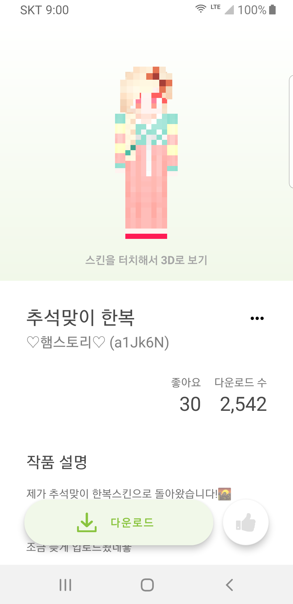
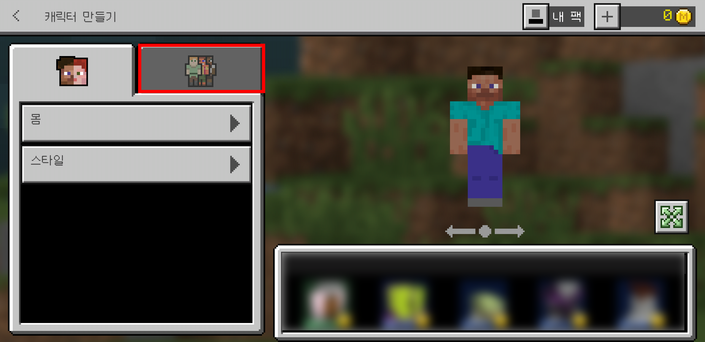

# Store for Minecraft 스킨 설치 가이드라인

Store for Minecraft에서 다운 받은 스킨은 대부분의 경우 Minecraft 앱에서 사용자가 직접 적용해야 합니다.

## 1. 자료 다운로드

Store for Minecraft 앱에서 설치하고자 하는 스킨을 찾으세요.

다운로드 버튼을 눌러서 해당 스킨 파일을 다운로드 합니다.

다운로드가 완료 되면, 이용자 휴대폰의 갤러리에서 해당 스킨 파일을 찾아보실 수 있습니다.

이제, 마인크래프트 안에서 스킨을 적용해보겠습니다.

> 다운로드 한 스킨 파일은 **내부저장소/StoreForMinecraft/files/skin** 에 저장됩니다.

## 2. 스킨 파일 적용하기

마인크래프트를 실행하세요.

마인크래프트 메인화면에서 **프로필 버튼**을 누르세요.

적용하려는 캐릭터를 고르고 **캐릭터 편집**을 누르세요.

**두번째 탭**을 선택하세요.

**보유함**을 누르세요.

**첫번째 아바타**를 클릭하세요.

**새 스킨 선택**을 누르세요.

갤러리가 실행되면, 아까 전 다운받은 스킨파일을 찾아 선택합니다.

스킨에 맞는 모델을 선택하세요.

짜잔! 스킨이 성공적으로 적용되었습니다.