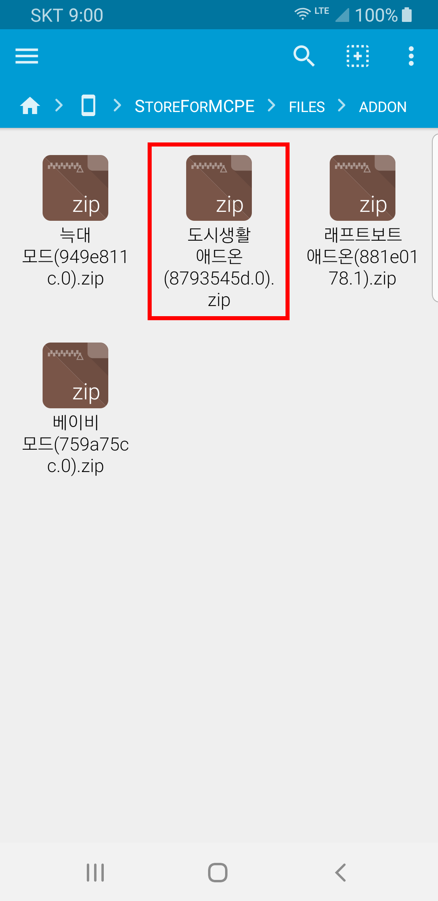
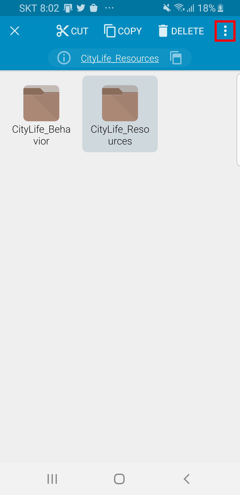
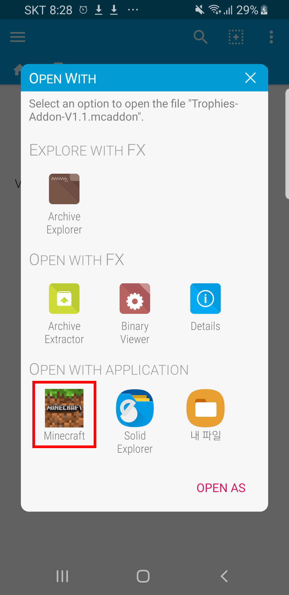
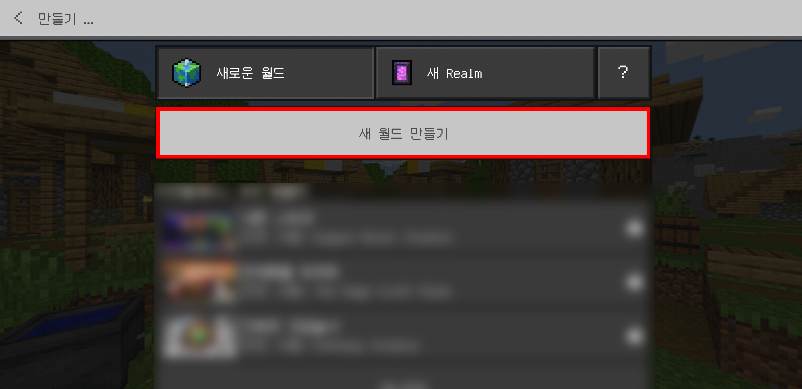

# Store for Minecraft 애드온 설치 가이드라인

애드온은 따로 자동설치를 지원하지 않기 때문에, **대부분의 경우 수동으로 설치**해야 합니다.

## 1. 자료 다운로드 하기

자료가 정상적으로 다운로드 되면 위 화면과 같이 "다운로드가 완료 되었습니다." 라는 문구를 확인하실 수 있습니다.

**애드온의 경우 대부분의 경우 수동으로 설치하셔야 합니다.**

아래 지시를 따라서 애드온을 설치해주시기 바랍니다.

## 2. 파일관리자 애플리케이션 설치하기

수동설치를 진행하기 위해서는 **압축해제를 지원하는 파일관리자 애플리케이션을 설치**하셔야 합니다.

휴대폰에 압축풀기를 지원하는 파일관리자 애플리케이션이 이미 있다면 이 단계는 건너뛰어도 됩니다.

아직 파일관리자 애플리케이션이 없다면, 저희는 **FX File Explorer**를 추천드립니다.

[Google Play에서 다운로드](https://play.google.com/store/apps/details?id=nextapp.fx)

파일관리자 설치가 완료되었다면 파일관리자 앱을 실행하세요.

## 3. 다운로드 된 자료 찾기

다운로드 파일 경로가 **/Downloads (다운로드 폴더)/SFOMDownload** 로 변경되었으니 참고하시기 바랍니다.

**"Main Storage"**를 클릭하세요.

**"StoreForMCPE"**를 찾아 클릭하세요.

**"files"**를 클릭하세요.

**"addon"**을 클릭하세요.

이 곳에서 다운로드 받은 애드온 파일들을 확인할 수 있습니다.

설치하려는 자료가 **zip 압축파일 형식인 경우 4 - A**를 참고해주시고, **.mcpack이나 .mcworld, .mcaddon인 경우 4 - B**를 참고해주시기 바랍니다.

## 4 - A. 다운로드 한 자료 설치하기 (.zip)

**설치하고자 하는 애드온 파일을 클릭**하세요.

일반적인 경우 애드온 자료는 **Behavior Pack과 Texture(또는 Resources) 가 포함** 되어 있습니다. 

이외의 경우는 자료 업로더가 작성한 설명을 보고 따라하시거나, 업로더에게 직접 연락을 취해 설치방법을 확인하셔야 합니다.

Behavior Pack(줄여서 bp라고도 칭합니다)과 Texture(또는 Resources, 줄여서 rp라고도 칭합니다) 폴더는 각각 다른 폴더에 압축을 풀어야 합니다

**Behavior Pack :** /games/com.mojang/behavior_packs/

**Texture(또는 Resources) :** /games/com.mojang/resources_packs/

압축해제 방법을 아신다면, 위 경로에 압축을 풀어주시면 되고 압축해제 방법을 모르신다면 아래 진행사항을 계속 따라주시면 됩니다.

두개의 파일 중 **Behavior 팩이 담긴 폴더**를 **길게 누르세요. (롱클릭)**

우측 상단의 **점 세개 메뉴**를 누르세요.

**"Extract"**버튼을 누르세요.

**"Main Storage"**를 누르세요.

**"games"**를 찾아 누르세요.

**"com.mojang"**을 누르세요.

**"behavior_packs"**를 누르세요.

**"EXTRACT HERE"**를 누르세요.

두개의 파일 중 **Texture(또는 Resources)팩이 담긴 폴더**를 **길게 누르세요. (롱클릭)**

우측 상단의 **점 세개 메뉴**를 누르세요.

**"Extract"**버튼을 누르세요.

**"Main Storage"**를 누르세요.

**"games"**를 찾아 누르세요.

**"com.mojang"**을 누르세요.

**"resource_packs"**를 누르세요.

**"Extract Here"**버튼을 누르세요.

위 항목들을 모두 진행하셨다면, 애드온 설치는 완료된것입니다. 아래(5번)에서는 적용 방법을 알아보겠습니다.

## 4 - B. 다운로드 한 자료 설치하기 (.mcworld, .mcpack, .mcaddon)

설치하려는 **애드온 파일**을 누르세요.

**"Minecraft"**를 누르세요.

**마인크래프트가 자동으로 실행**됩니다.

자동으로 설치가 진행되며, 위와 같이 **불러오기 성공이라는 메세지**가 나오면 설치가 완료된 것입니다.

## 5. 애드온 적용하기

애드온은 맵을 새로 생성할 당시에 적용할 수 있습니다.

**애드온 설치 후 마인크래프트를 재시작**하세요.

**"월드 새로 만들기"**를 누르세요.

**"새 월드 만들기"**를 누르세요.

**"리소스 팩"**을 누르고, **원하는 리소스팩을 선택**해서 **"활성화"**버튼을 누르세요.

**"행동 팩"**을 누르고, **원하는 행동팩을 선택**해서 **"활성화"**버튼을 누르세요.

대부분의 경우 리소스 팩과 행동 팩이 모두 포함되어있으니, **동일한 자료 두개 모두 활성화를 시켜주어야 합니다.**

이제, 월드를 만들어서 설치한 애드온을 즐겨보세요!