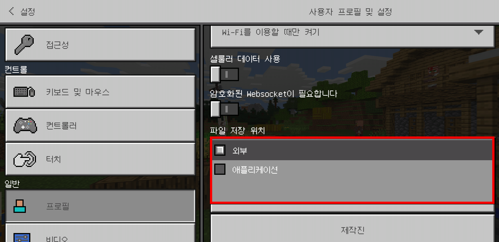
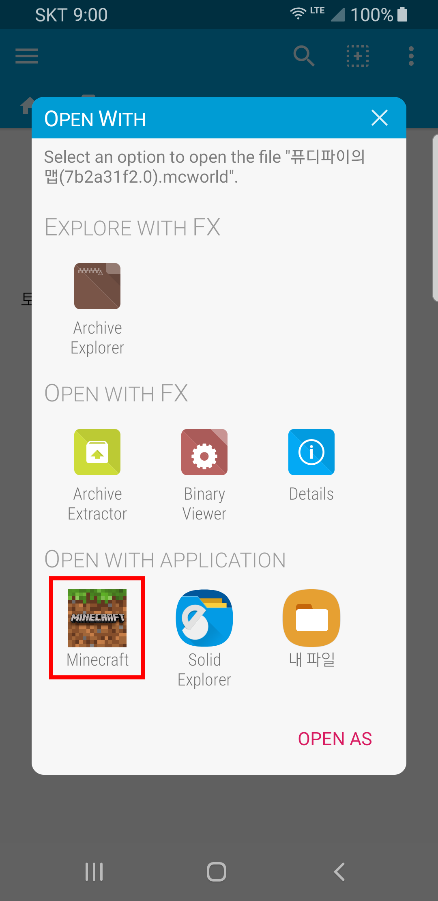

# Store for Minecraft 맵 설치 가이드라인

Store for Minecraft에 업로드 된 대부분의 맵의 자료는 **자동설치가 이루어져서 마인크래프트 포켓에디션을 시작하면 맵을 찾아 볼 수 있습니다.**

다만 일부 휴대폰이나 특정 상황에 따라 이 맵 설치가 자동으로 되지 않는 경우가 존재하고, 이 경우 수동설치 할 수 있는 방법을 알려드립니다.

## 1. 자료 다운로드하기

자료가 정상적으로 다운로드 되면 위 화면과 같이 "다운로드가 완료 되었습니다." 라는 문구를 확인하실 수 있습니다.

**맵의 경우 다운로드와 함께 자동으로 설치**가 이루어지며, **즉 정상적인 상태에서는 다운로드가 완료되면 바로 마인크래프트에서 해당 맵 플레이가 가능**합니다.

다만 일부 경우 내부적인 오류로 인해서 설치가 정상적으로 이루어지지 않는 이유가 있고, 이 경우에는 다음 단계를 따라 수동설치를 시작해주시기 바랍니다.

### 1 - A. 설치가 완료되었지만 보이지 않는 경우

간혹 설치가 정상적으로 완료되었지만, 마인크래프트에서는 보이지 않는 경우가 있습니다. 이 경우는 맵 파일 자체가 잘못되었거나, 마인크래프트에서 맵 저장공간이 "애플리케이션"으로 설정된 경우 입니다.

이때, 마인크래프트에서 파일 저장 위치를 "외부"로 설정해주셔야 합니다.

마인크래프트에서 **설정**을 들어갑니다.

**프로필**을 선택합니다.

파일 저장 위치가 "애플리케이션" 이라면 "**외부**"로 바꿔줍니다.

**해당 방법을 통해서도 설치문제가 해결 되지 않는 경우, 수동설치를 시작하세요.**

## 2. 파일관리자 애플리케이션 설치하기

수동설치를 진행하기 위해서는 **압축해제를 지원하는 파일관리자 애플리케이션을 설치**하셔야 합니다.

휴대폰에 압축풀기를 지원하는 파일관리자 애플리케이션이 이미 있다면 이 단계는 건너뛰어도 됩니다.

아직 파일관리자 애플리케이션이 없다면, 저희는 **FX File Explorer**를 추천드립니다.

[Google Play에서 다운로드](https://play.google.com/store/apps/details?id=nextapp.fx)

파일관리자 설치가 완료되었다면 파일관리자 앱을 실행하세요.

## 3. 다운로드 된 자료 찾기

다운로드 파일 경로가 **/Downloads (다운로드 폴더)/SFOMDownload** 로 변경되었으니 참고하시기 바랍니다.

**"Main Storage"**를 누르세요.

**"StoreForMCPE"**를 찾아 누르세요.

**"files"**을 누르세요.

**"map"**을 누르세요.

이곳에서 다운로드 했던 맵들을 확인할 수 있습니다.

이제 다운로드 한 자료를 수동설치 하는 방법을 알아보도록 하겠습니다.

다운로드 한 자료의 확장자가 **zip 압축파일인 경우 4 - A**지시에 따르고, **.mcworld인 경우 4 - B**지시에 따르세요. 

## 4 - A. 다운로드 한 자료 설치하기 (.zip)

설치하고자 하는 맵 파일을 **길게 누르세요. (롱 클릭)**

**점 세개 메뉴**를 누르세요.

**"Extract"**를 누르세요.

**"Main Storage"**를 누르세요.

**"games"**를 누르세요.

**"com.mojang"**을 누르세요.

**"minecraftWorlds"**를 누르세요.

**"EXTRACT HERE"**를 누르세요.

축하합니다. 맵 설치가 완료되었으며 마인크래프트 앱에서 플레이 하실 수 있습니다.

> 해당자료가 이미 설치된 경우에는 오류가 발생할 수 있습니다. 이 경우 기존에 있던 자료를 삭제해주셔야 합니다.

## 4 - B. 다운로드 한 자료 설치하기 (.mcworld)

설치하려는 맵 파일을 누르세요.

**"Minecraft"**를 누르세요.

마인크래프트가 실행되면서 설치가 시작됩니다.

위 처럼 레벨 불러오기가 완료되었다는 메세지가 나온다면 맵 설치가 완료된 것입니다.

축하합니다. 맵 설치가 완료되었으며 마인크래프트 앱에서 플레이 하실 수 있습니다.