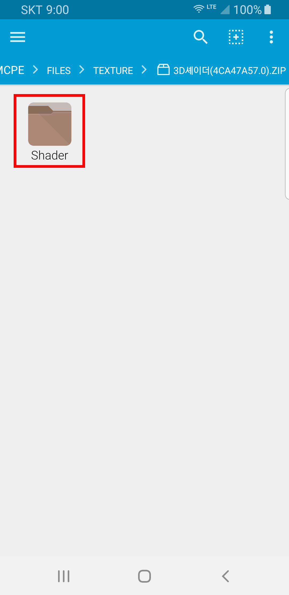
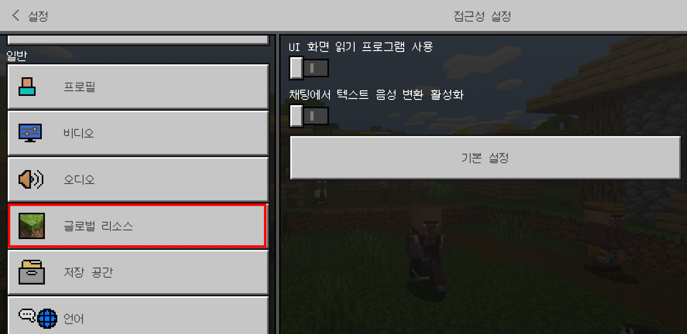
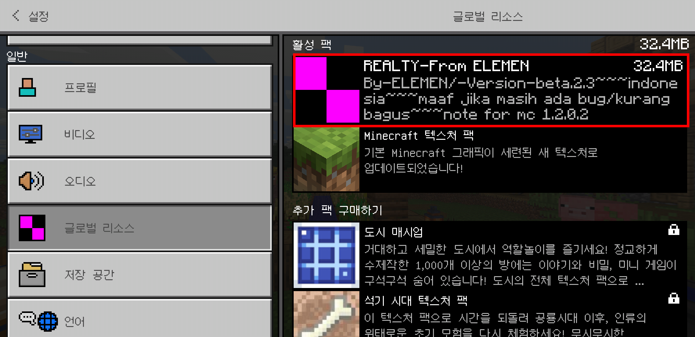

# Store for Minecraft 텍스처팩 설치 가이드라인

Store for Minecraft에 업로드 된 대부분의 텍스처팩의 자료는 **자동설치가 이루어져서 마인크래프트 포켓에디션을 시작하면 텍스처팩을 찾아 볼 수 있습니다.**

다만 일부 휴대폰이나 특정 상황에 따라 이 텍스처팩 자료의 설치가 자동으로 되지 않는 경우가 존재하고, 이 경우 수동설치 할 수 있는 방법을 알려드립니다.

## 1. 자료 다운로드하기

자료가 정상적으로 다운로드 되면 위 화면과 같이 "다운로드가 완료 되었습니다." 라는 문구를 확인하실 수 있습니다.

**텍스처팩의 경우 다운로드와 함께 자동으로 설치**가 이루어지며, **즉 정상적인 상태에서는 다운로드가 완료되면 바로 마인크래프트에서 해당 텍스처팩을 확인할 수 있습니다.**

다운로드 후, **"5. 설치된 텍스처팩 마인크래프트에서 적용하기"**를 따라주세요. 

마인크래프트에서 다운로드한 텍스처팩이 보이지 않는다면 **"2. 파일관리자 애플리케이션 설치하기"**부터 수동설치 과정을 따라주시기 바랍니다.

## 2. 파일관리자 애플리케이션 설치하기

수동설치를 진행하기 위해서는 **압축해제를 지원하는 파일관리자 애플리케이션을 설치**하셔야 합니다.

휴대폰에 압축풀기를 지원하는 파일관리자 애플리케이션이 이미 있다면 이 단계는 건너뛰어도 됩니다.

아직 파일관리자 애플리케이션이 없다면, 저희는 **FX File Explorer**를 추천드립니다.

[Google Play에서 다운로드](https://play.google.com/store/apps/details?id=nextapp.fx)

파일관리자 설치가 완료되었다면 파일관리자 앱을 실행하세요.

## 3. 다운로드 된 자료 찾기

다운로드 파일 경로가 **/Downloads (다운로드 폴더)/SFOMDownload** 로 변경되었으니 참고하시기 바랍니다.

**"Main Storage"**를 클릭하세요.

**"StoreForMCPE"**를 찾아 클릭하세요.

**"files"**를 클릭하세요.

**"texture"**을 클릭하세요.

이 곳에서 다운로드 받은 텍스처팩 파일들을 확인할 수 있습니다.

설치하려는 자료가 **zip 압축파일 형식인 경우 4 - A**를 참고해주시고, **.mcpack이나 .mcworld, .mcaddon인 경우 4 - B**를 참고해주시기 바랍니다.

## 4 - A. 다운로드 한 자료 설치하기 (.zip)

**설치하고자 하는 텍스처팩 파일을 클릭**하세요.

**압축파일 내부의 폴더**를 **길게 누르세요. (롱클릭)**

우측 상단의 **점 세개 메뉴**를 누르세요.

**"Extract"**버튼을 누르세요.

**"Main Storage"**를 누르세요.

**"games"**를 찾아 누르세요.

**"com.mojang"**을 누르세요.

**"resource_packs"**를 누르세요.

**"Extract Here"**버튼을 누르세요.

위 항목들을 모두 진행하셨다면, 텍스처팩 설치는 완료된것입니다. 아래(5번)에서는 적용 방법을 알아보겠습니다.

## 4 - B. 다운로드 한 자료 설치하기 (.mcworld, .mcpack, .mcaddon)

설치하려는 **텍스처팩 파일**을 누르세요.

**"Minecraft"**를 누르세요.

**마인크래프트가 자동으로 실행**됩니다.

자동으로 설치가 진행되며, 위와 같이 **불러오기 성공이라는 메세지**가 나오면 설치가 완료된 것입니다.

## 5. 설치된 텍스처팩 마인크래프트에서 적용하기

마인크래프트 메인 화면에서 **설정**을 누르세요.

**글로벌 리소스 버튼**을 누르세요.

사용하려는 텍스처팩을 누르고, **+ 버튼**을 누르세요.

사용하려는 **텍스처팩이 "활성 팩" 가장 위쪽에 위치한다면 적용이 완료된 것**입니다. 

가장 위쪽에 위치해 있지 않다면 텍스처팩을 클릭하고 상하 화살표 버튼을 눌러서 조정해 주세요.