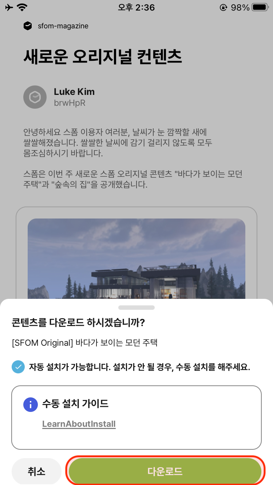

# iOS 자료 수동 설치 방법 - 맵

**iOS의 경우** 다른 애플리케이션의 직접적인 접근이 불가능하여 수동으로 설치하는 방식만 제공해드리는 점 양해부탁드립니다.

이 글에서는 SFOM에서 "맵" 자료를 다운로드 하여 사용자의 마인크래프트에 적용하는 방법을 설명합니다.

## 이미지 가이드

| 원하는                                               | 맵을                                                | 다운로드!                                             |
|---------------------------------------------------|---------------------------------------------------|---------------------------------------------------|
|  |  |  |

| 파일 앱 ->                                           | 나의 아이폰 ->                                         | 스폼 ->                                             | 
|---------------------------------------------------|---------------------------------------------------|---------------------------------------------------|
|  |  |  | 

| downloads ->                                      | map ->                                            | 컨텐츠 선택                                            |
|---------------------------------------------------|---------------------------------------------------|---------------------------------------------------|
|  |  |  |

| 로딩                                                | 마인크래프트 재실행                                       | 맵 즐기기!                                            |
|---------------------------------------------------|--------------------------------------------------|---------------------------------------------------|
|  |  |  |

## 자료 다운로드 하기

1. 스폼 애플리케이션에서 "맵" 자료를 다운로드 합니다.
2. 다운로드가 완료 된 파일은 "나의 iPhone" > "스폼" > "downloads" > "map" > "자료 게시글 이름" 저장 됩니다.
    1. 예시를 들어 "숲속의 오두막" 이라는 게시 자료를 다운로드 받았다면 설치 경로는 "나의 iPhone" > "스폼" > "downloads" > "map" > "자료 게시글 이름" 입니다.

## 자료 설치하기 - ZIP 압축 파일의 경우

1. 다운로드 된 자료가 zip 확장자 일 경우 ("자료 이름.zip" 형태), 설치하려는 파일을 한번 클릭합니다.
2. 다운로드 된 파일 옆에 압축이 해제 된 디렉토리가 생기는 것을 확인합니다.
3. 일반적으로 설치 할 수 있는 맵 자료는 level.dat 파일이 최상위에 위치하는 디렉토리 단위입니다.
4. 3번에서 설명하는 디렉토리를 길게 눌러서 "1개의 항목 복사" 버튼을 누릅니다.
5. "나의 iPhone" > "Minecraft" > "games" > "com.mojang" > "minecraftWorlds" 경로로 진입합니다.
6. 해당 경로에서 빈 공간을 눌러 "붙여넣기" 버튼을 누릅니다.
7. "Minecraft" 게임에 접속하여 다운로드 받은 맵 자료가 정상적으로 적용되었는지 확인합니다.

## 자료 설치하기 - mcworld 파일의 경우

1. 다운로드 된 자료가 mcworld 확장자 일 경우 ("자료 이름.zip" 형태), 설치하려는 파일을 한번 클릭합니다.
2. "Minecraft" 게임이 실행되어 패치 되는지 확인합니다.
    1. 일부 mcworld 파일의 경우 Minecraft 게임에서 가져오기가 실패하는 경우가 있습니다.
    2. 이 경우, "자료 이름.mcworld" 파일을 "자료 이름.zip" 파일로 변경합니다.
    3. "자료 설치하기 - ZIP 압축 파일의 경우" 지침을 따라 설치를 진행합니다.

---

Luke Kim, 작성 : 2023년 2월 24일  
Jeonhui Lee, 수정 : 2023년 7월 17일 